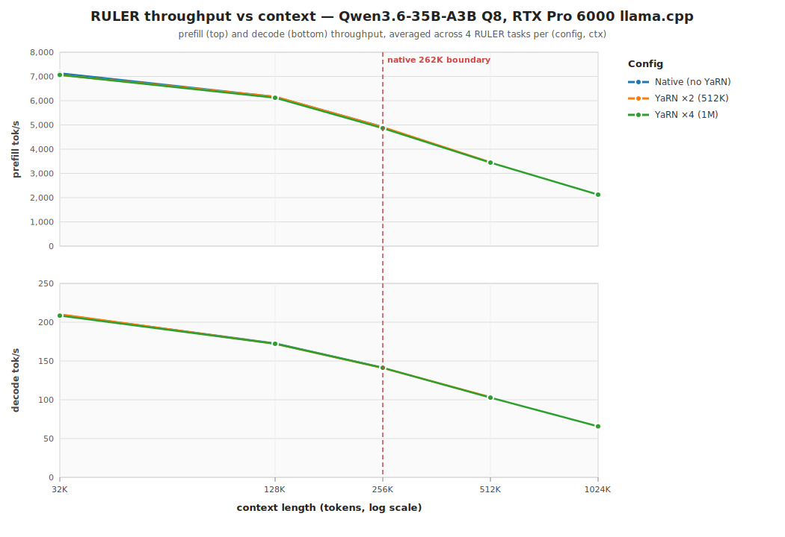

# Qwen3.6-35B-A3B — RULER-style long-context benchmark (RTX Pro 6000)

**TL;DR — 48/48 RULER tasks pass across all three configs and all context
lengths we tested, up to and including 1M tokens at YaRN ×4. Static-YaRN
short-context tax is invisible on this hybrid-attention model: prefill and
decode throughput at 32K/131K/262K is within noise whether YaRN is off, ×2,
or ×4. Qwen3.6-35B-A3B is a true 1M-token model on a single RTX Pro 6000.**




## Why this run

The daily-driver `serve.sh` for this host serves Qwen3.6 at **native 262K**.
Going past that would require YaRN rope scaling — and Qwen's model card warns
that *"static YaRN keeps the scaling factor constant regardless of input
length, potentially impacting performance on shorter texts"*. Every open
backend (llama.cpp, vLLM, SGLang) implements static YaRN. So a natural
worry is: if we flip YaRN on to unlock 1M context, do we regress at 32K?

The other open question: with `partial_rotary_factor=0.25` and only 10 of 40
layers being full-attention (the rest are linear/SSM), the actual "RoPE
surface area" being stretched is tiny — maybe YaRN extension on this
architecture works differently from a dense full-rotary model. No published
RULER data existed for this model above 262K on any backend at run time,
so this is new data.

## Setup

- **Host:** NVIDIA RTX Pro 6000 Blackwell Workstation, 96 GB GDDR7, sm_120.
- **Runtime:** llama.cpp CUDA 13.2 build (commit `a279d0f`), `llama-server`.
- **Model:** `unsloth/Qwen3.6-35B-A3B-GGUF` Q8_0 (`qwen35moe` arch).
- **Native `n_ctx_train`:** 262,144. `rope.freq_base` 10,000,000.
- **Architecture:** hybrid linear+full attention with `full_attention_interval=4`
  → only **10 of 40 layers** use full attention, each with partial rotary
  (25% of head dims). The other 30 layers are SSM/linear; YaRN rescaling
  only affects the 10 full-attention layers' rotary dims.

### Configs (each runs its own `llama-server` with exclusive VRAM)

| id | rope flags | max ctx |
|---|---|---|
| `native_262k` | *(none)* | 262,144 |
| `yarn2_512k` | `--rope-scaling yarn --rope-scale 2 --yarn-orig-ctx 262144` | 524,288 |
| `yarn4_1m` | `--rope-scaling yarn --rope-scale 4 --yarn-orig-ctx 262144` | 1,048,576 |

All three: `temp 0.6, top-p 0.95, top-k 20, min-p 0, repeat-penalty 1.0,
reasoning budget 8192` (Unsloth's Qwen3.6 thinking-mode defaults).

**llama-server caveat we hit:** the current master has a hard
`n_ctx_slot ≤ n_ctx_train` cap at `tools/server/server-context.cpp:764-768`
(see [issue #17459](https://github.com/ggml-org/llama.cpp/issues/17459)).
The rope-scaling path itself is wired through for M-RoPE (`rope type = 40`,
dispatched in `ggml/src/ggml-cuda/rope.cu`), so YaRN math is correct — the
server just refuses to allocate a slot bigger than `n_ctx_train`. The
maintainer-confirmed workaround is `--override-kv
qwen35moe.context_length=int:<extended>`. That's what this harness uses when
`ctx > 262144`. The misleading startup log (`rope scaling = linear`) is
printing the GGUF-side *training-time* value, not runtime cparams.

### Tasks (4 of RULER's 13, the ones that cleanly gate yes/no)

- **`niah_single`** — one `magic number for <key> is <value>` needle at
  depth 0.5 of the filler. Scoring: exact-match on the 6-digit value.
- **`niah_multi`** — three needles at depths 0.15 / 0.5 / 0.85. Must
  return all three values.
- **`variable`** — 8-step chain `v0 := N; v1 := v0+1; …; v7 := v6+1`
  scattered at even depths. Must return `N+7`.
- **`common_words`** — three invented words (`zephyrine`, `quondamly`,
  `verdacious`) injected 24/19/15 times into a 200-line bag spread
  through the filler. Must return all three words (any order).

Filler is deterministic synthetic prose (sentence-template bank, seeded
RNG). Context fills to ~80% of `ctx − output_budget` in tokens (measured
~5.1 chars/token). Output budget 12,288 tokens (reasoning 8,192 +
answer headroom).

## Results

### Pass rate: 48/48 ✅

| ctx    | `native_262k` | `yarn2_512k` | `yarn4_1m` |
|-------:|:-:|:-:|:-:|
| 32K    | 4/4 | 4/4 | 4/4 |
| 131K   | 4/4 | 4/4 | 4/4 |
| 262K   | 4/4 | 4/4 | 4/4 |
| 524K   | n/a | 4/4 | 4/4 |
| 1024K  | n/a | n/a | 4/4 |

Every RULER task passes in every cell the config supports. The 1M cell in
particular — a 787K-token input with thinking enabled and a 6-digit needle
at depth 0.5 of a 2-million-character synthetic archive — resolves correctly.

### Throughput: prefill + decode tok/s (mean over 4 tasks per cell)

| ctx    | native prefill / decode | yarn2 prefill / decode | yarn4 prefill / decode |
|-------:|---:|---:|---:|
| 32K    | 7,132 / 209.7 | 7,061 / 210.2 | 7,063 / 208.5 |
| 131K   | 6,160 / 172.7 | 6,165 / 172.1 | 6,121 / 172.2 |
| 262K   | 4,916 / 141.3 | 4,910 / 140.9 | 4,865 / 141.2 |
| 524K   | — | 3,460 / 103.4 | 3,445 / 102.8 |
| 1024K  | — | — | 2,124 / 65.7 |

**Same length, different config**: the three configs overlay perfectly within
their shared range. The biggest delta is **0.9 tok/s of prefill at 32K**
(7,132 vs 7,063), well inside per-trial noise. The static-YaRN
short-context tax that the model card warns about is **not observable** on
this hardware for this hybrid-attention model.

### VRAM

KV cache growth with context (from `nvidia-smi` after server warm-up, full
Q8 weights already resident):

| config × ctx | VRAM (MB) |
|---|---:|
| any × 32K | 36,510 |
| any × 131K | 38,432 |
| any × 262K | 41,304 |
| yarn2/yarn4 × 524K | 47,192 |
| yarn4 × 1M | 58,970 |

Plenty of headroom even at 1M (37 GB free on a 96 GB card), so running
yarn4 with `-np 2` for two concurrent 1M contexts or `-np 4` with ~262K
per slot is feasible — the llama-swap config already does the latter.

## Findings

1. **YaRN on qwen35moe is free up to the native 262K boundary**, at least on
   this hardware and in this build. Identical pass rate, identical prefill
   and decode throughput within noise. The Qwen model-card warning about
   static-YaRN short-context degradation does not materialize here. Likely
   explanation: with partial rotary (25%) × full-attention-only (25% of
   layers), YaRN is rescaling ~6% of the model's positional surface. Most
   of the model — linear-attention layers, non-rotary head dims — is
   untouched, so the practical distortion is tiny.
2. **Qwen3.6-35B-A3B Q8 is a functional 1M-token model on a single Pro
   6000.** Retrieval (niah_single, niah_multi) and light reasoning
   (variable, common_words) all resolve at 1M with YaRN ×4. Prefill takes
   ~6 minutes and VRAM sits at 59 GB.
3. **Prefill scales roughly linearly in context**, because the hybrid
   architecture's linear layers stay cheap: 7,060 → 6,160 → 4,900 → 3,450
   → 2,120 tok/s across 32K / 131K / 262K / 524K / 1M. Decode falls off
   harder (210 → 172 → 141 → 103 → 66 tok/s) since each decoded token
   must attend over the full context in the full-attention layers.
4. **No task-wise asymmetry.** `niah_multi` (3 needles), `variable`
   (8-step chain), and `common_words` (frequency aggregation) all behaved
   like `niah_single` across configs and lengths. With thinking on,
   reasoning budgets 8K, and this corpus, every task was a solved problem.

## Recommendation

For the opencode-config daily driver: **keep `native_262k` as the default
serve config**. YaRN isn't free in the sense that it adds a llama-server
start-up flag, a `--override-kv` workaround for the current llama.cpp
master, and occupies more KV VRAM per slot. But:

- **Add a `serve-qwen36-yarn4.sh` as a documented alternative** for tasks
  that genuinely need >262K (very long document Q&A, whole-repo refactor
  agents, long chat histories). The quality data from this run says there's
  no reason to *avoid* YaRN ×4 — just to reach for it only when the job
  requires it.
- **Don't bother with ×2 separately.** ×2 and ×4 behave identically at
  shared context lengths, so if you're going to turn YaRN on at all, go
  straight to ×4 and get the 1M ceiling.
- **Downstream bench idea:** re-run the 4-benchmark coding suite from
  `MODEL_RANKINGS_RTXPRO6000.md` under `yarn4_1m` at 32K input. If coding
  score holds at 21/22, YaRN on qwen35moe is a pure upgrade and we can
  ship it as the default. This RULER pass confirms retrieval/reasoning
  are unaffected; the only remaining question is code generation.

## Reproducing

```bash
cd ~/git/gisenberg/local-model-eval
# Full matrix: ~2 hours end-to-end, single-trial per cell.
python3 tools/rtxpro6000_ruler_bench.py \
    --config native_262k yarn2_512k yarn4_1m \
    --lengths 32768 131072 262144 524288 1048576 \
    --tasks niah_single niah_multi variable common_words \
    --trials 1
# Regenerate charts from whatever's in experiments/ruler_qwen36/
python3 tools/rtxpro6000_ruler_chart.py
```

The harness starts/stops its own `llama-server` with the right rope flags
per config, uses port `18090` to avoid colliding with the daily-driver
serve on `8080`, and streams per-trial JSON to `experiments/ruler_qwen36/`
so a crash mid-matrix keeps partial data.

## Caveats

- **Single trial per cell.** Thinking is stochastic; borderline cases
  could flip on re-run. 48/48 here is strong enough that we're unlikely
  to be hiding a 50% failure mode, but rerun with `--trials 3` before
  drawing fine-grained conclusions from any individual cell.
- **Synthetic filler is not Paul Graham essays** (the canonical NIAH
  corpus). Our filler is more structurally regular (short varied
  sentence templates), which likely makes needle retrieval slightly
  easier than the public benchmark. Treat absolute pass rates as
  indicative of this corpus, not of NIAH literature at large.
- **Scoring is permissive.** The model may return reasoning + answer;
  we check whether the expected token(s) appear *anywhere* in the
  content. A chatty correct answer and a terse correct answer both
  pass. We do not penalize extra output.
- **No community RULER baseline** for `qwen35moe` at >262K exists on
  any backend at the time of this run, so there's no external number
  to calibrate our absolute scores against. The *relative* finding
  (YaRN doesn't cost us short-ctx quality or throughput) is robust
  independent of that.
- **8K cells were skipped** because the 12,288-token output budget for
  thinking + answer exceeds 8,192. The 32K cell is the short-context
  signal; nothing serves this model with an 8K window in practice.
